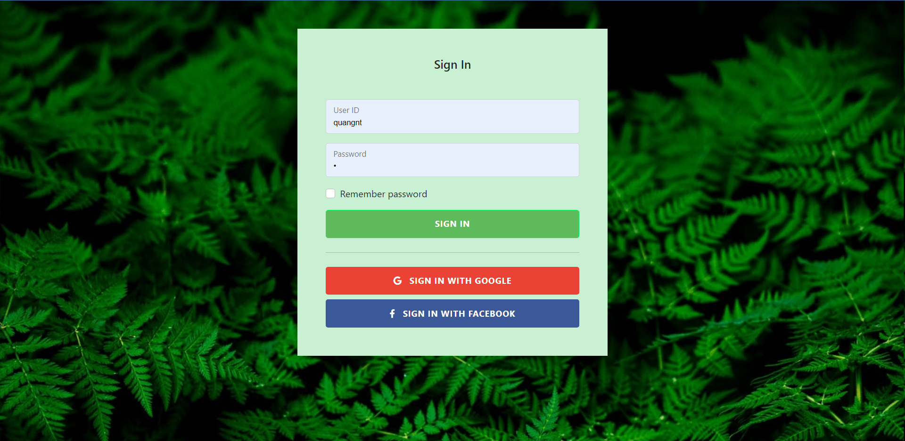
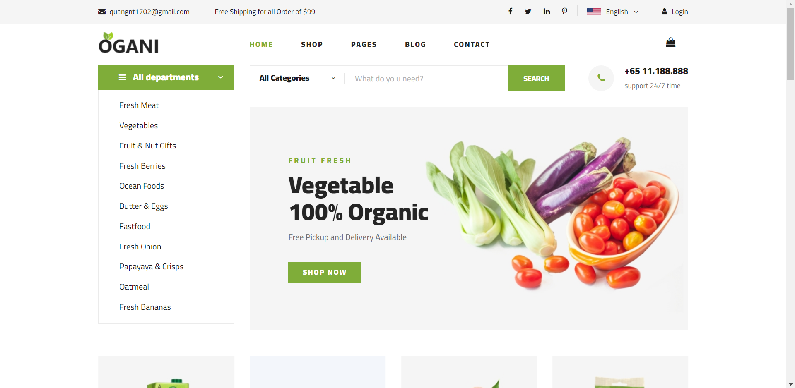
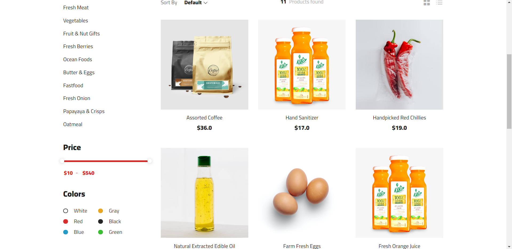
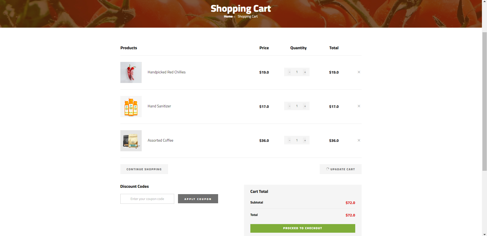
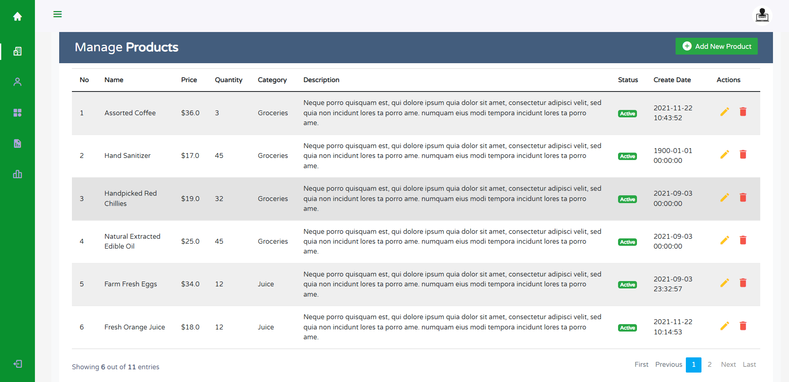

# Organic Store- Java Servlet + JSP 

## Case Study

Organic store is a ecommerce website that allows customers to orders organic products and pay the orders online.

## Roles

 ### Customer
	- Search, show product details
	- Add product to cart
	- Pay the order
 ### Administrator
	- Manage customer accounts
	- Manage products
	- Manage categories
	- Manage orders
## Technology
	- Java Servlet
	- JSP, Scripting elements
	- MVC architecture
	- SQL Server 2019 - Database
## Picture
### Login Page

### Home Page

### Shop Page

### Shop Cart Page

### Management Page

### QuangNT © 2021